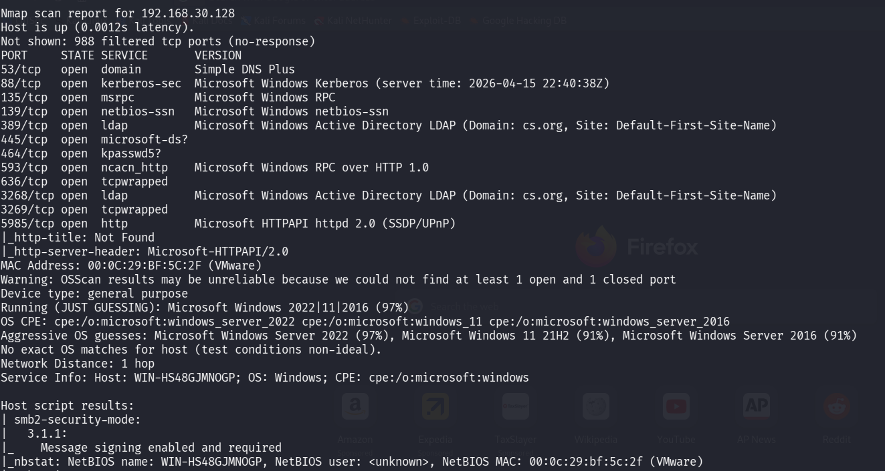
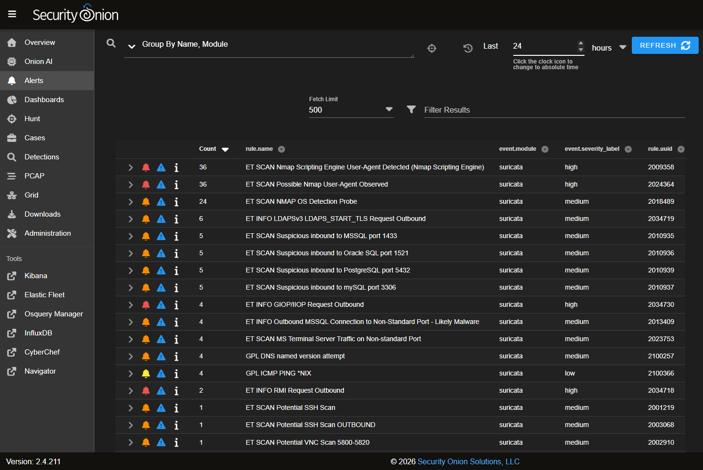
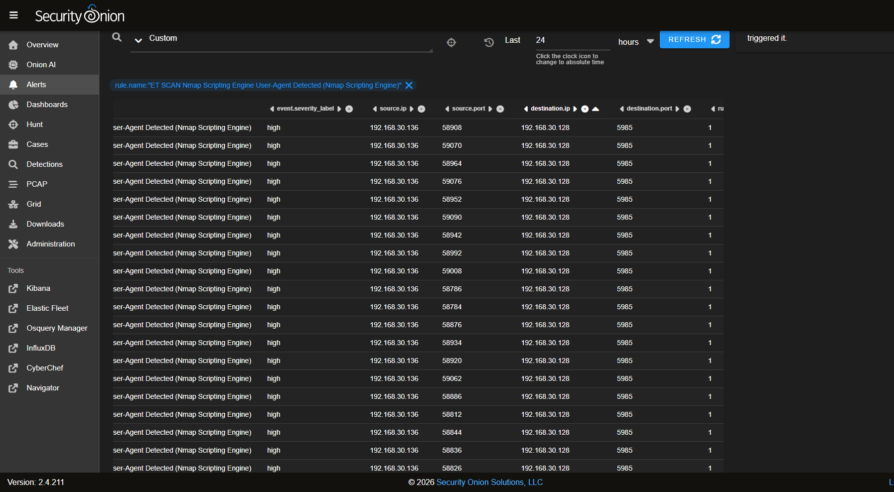
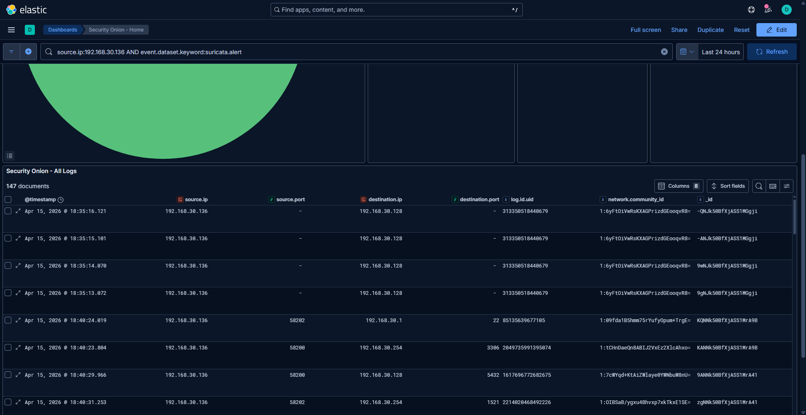
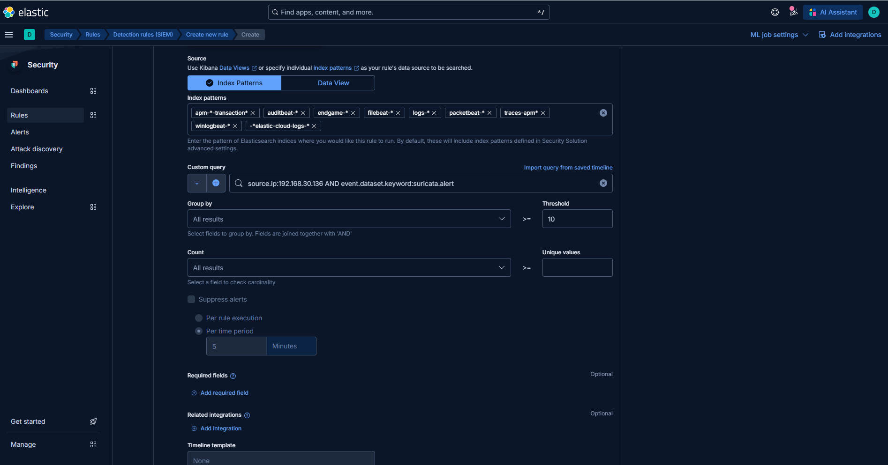
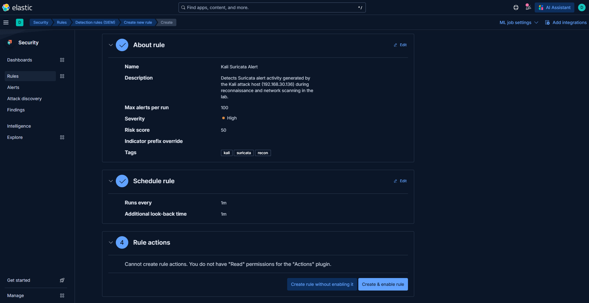
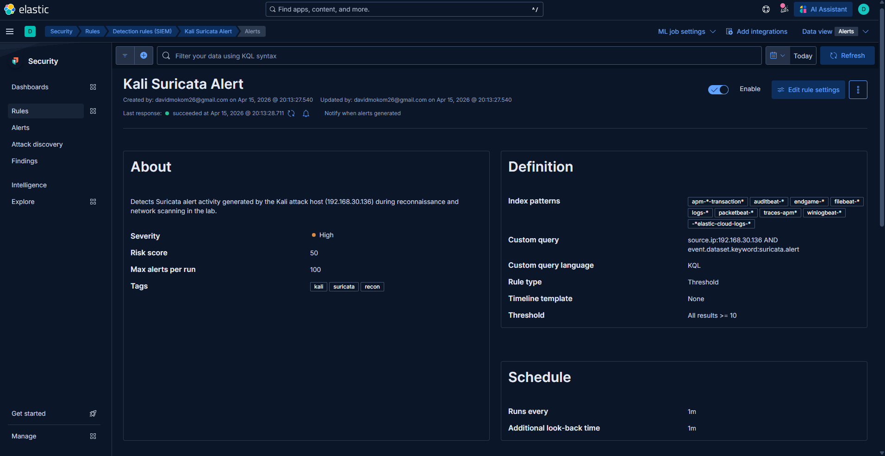
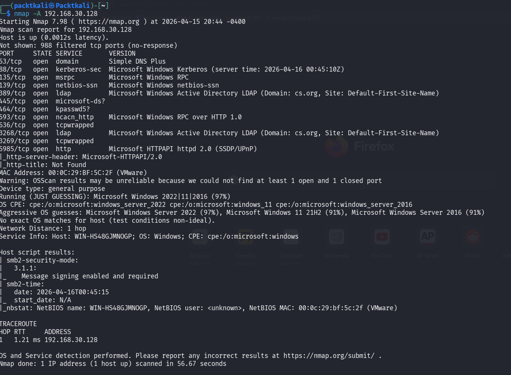
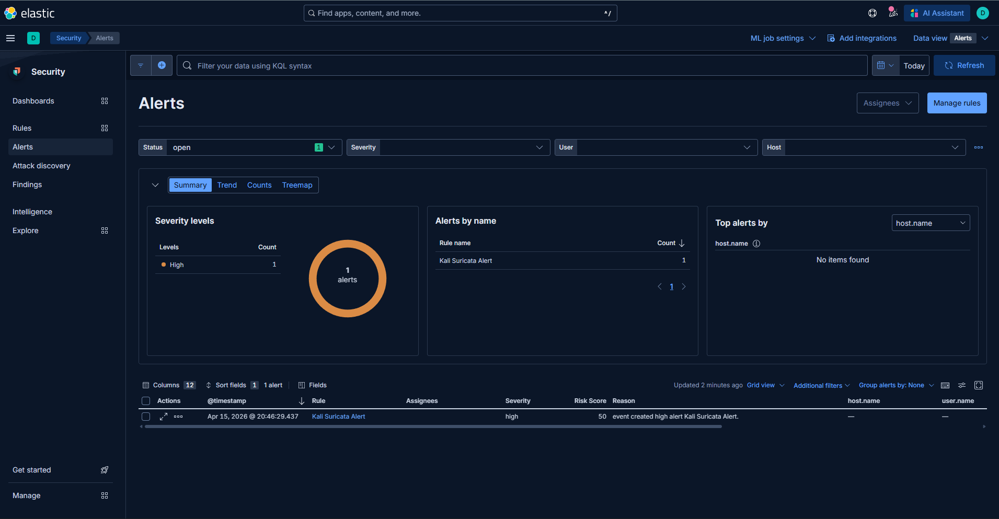

# Phase 1: Reconnaissance Detection and Custom SIEM Rule Validation in Security Onion

## Overview

In this lab, I simulated reconnaissance activity using Nmap against an internal domain controller in my home SOC environment.

After running the scan from a Kali Linux machine, I analyzed how Security Onion detected the activity. I reviewed alerts in Elastic, identified the attacker source IP, and examined the related logs to understand how the scan was captured.

Based on what I observed, I created a custom detection rule in Kibana to catch repeated scan behavior. I then re-ran targeted scans to confirm that the rule triggered consistently.

---

## Lab Environment

### Systems
- Kali Linux (attacker)
- Windows Server (Domain Controller)
- Security Onion (SIEM)

### Tools Used
- Nmap
- Security Onion
- Kibana (Elastic)
- Suricata

---

## Attack Simulation

A reconnaissance scan was performed from the Kali Linux machine targeting the domain controller using Nmap.

The goal was to generate detectable network activity and observe how it appeared in Security Onion.

---

## Detection & Analysis

After running the scan:

- Alerts were generated in Security Onion
- The attacker source IP was identified
- Relevant logs were analyzed in Kibana
- Suricata logs showed clear evidence of scan behavior

This helped confirm that reconnaissance activity was being properly captured and logged.

---

## Rule Creation & Validation

A custom threshold-based detection rule was created in Kibana to detect repeated scan activity.

To validate the rule:
- Additional targeted scans were performed
- Alerts were triggered consistently
- Detection behavior matched expectations

This confirmed that the rule was working as intended.

---

## Key Takeaways

- Nmap scans generate clear and detectable patterns in network logs
- Identifying the source IP is critical when investigating alerts
- Detection rules help turn raw alerts into something actionable
- Re-testing attacks is important to confirm detections actually work

---

## Screenshots

---

## Conclusion

This lab showed how reconnaissance activity can be detected and investigated using Security Onion.

By analyzing alerts and building a custom rule, I moved from simply observing activity to creating a working detection. This sets the foundation for the next phase, which will focus on initial access techniques.